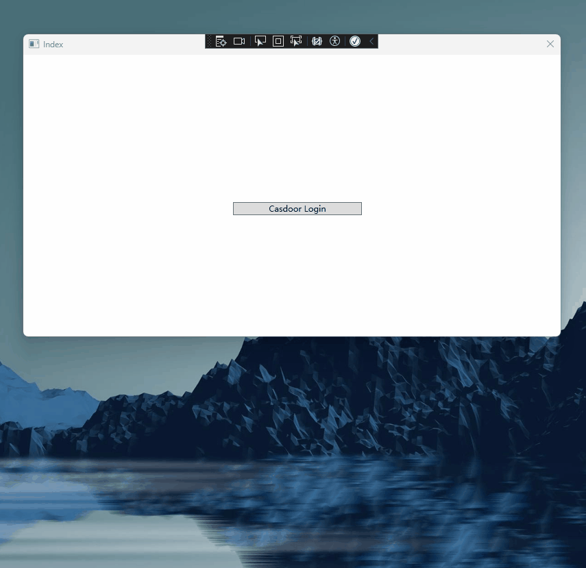

# casdoor-dotnet-desktop-example

This project was bootstrapped with [WPF](https://github.com/dotnet/wpf) and [dotnet](https://www.dot.net/).

## Prerequisites

[dotnet6 sdk](https://dotnet.microsoft.com/en-us/download)

[webview2 runtime](https://developer.microsoft.com/zh-cn/microsoft-edge/webview2/#download-section) (It's already preinstalled in your windows generally)

## Init example

You need to init requires 5 parameters, which are all string type:

| Name                  | Description                                                                                             | File                  |
| ------------          | ------------------------------------------------------------------------------------------------------- | --------------------- |
| Domain                | Your Casdoor server host/domain                                                                         | `CasdoorVariables.cs` |
| ClientId              | The Client ID of your Casdoor application                                                               | `CasdoorVariables.cs` |
| AppName               | The name of your Casdoor application                                                                    | `CasdoorVariables.cs` |
| CallbackUrl           | The path of the callback URL for your Casdoor application, will be `casdoor://callback` if not provided | `CasdoorVariables.cs` |
| OrganizationName      | The organizatio name of your Casdoor application                                                        | `CasdoorVariables.cs` |
| ApplicationType       | Webapp, webapi or native                                                                                | `CasdoorVariables.cs` |
| Scope                 | The scopes that the client is requesting                                                                | `CasdoorVariables.cs` |
| RequireHttpsMetadata  | Whether require https for casdoor endpoint                                                              | `CasdoorVariables.cs` |

If you don't set these parameters, this project will use the [Casdoor online demo](https://door.casdoor.com) as the defult Casdoor server and use the [Casnode](https://door.casdoor.com/applications/app-casnode) as the default Casdoor application.

## How to run it

### Visual Studio

1. Open casdoor-dotnet-desktop-example.sln
2. Press Ctrl + F5 to start

### Command line

1. cd src/DesktopApp
2. dotnet run
